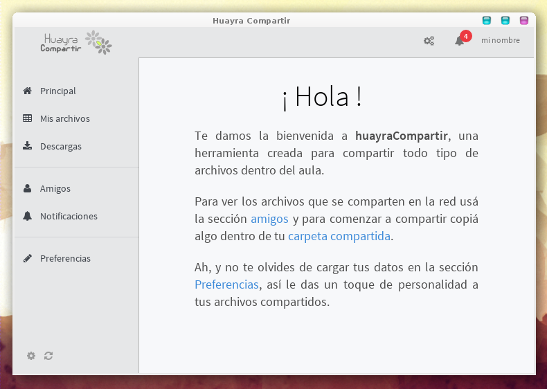
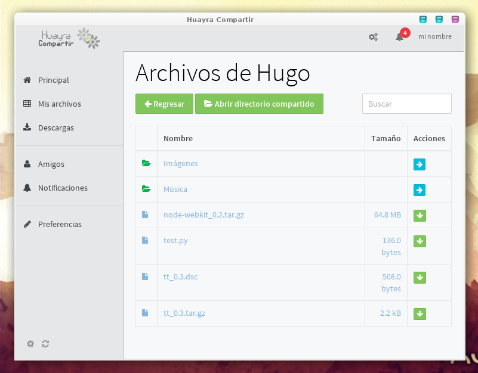

# IMPORTANTE !!!

Esta aplicación está en proceso de refactorización, así que tenemos dos branch para
seguir el desarrollo. Mirá la siguiente página para conocer más al respecto:

- https://github.com/HuayraLinux/huayra-compartirweb/wiki/Clarificaci%C3%B3n-de-versiones

Huayra-Compartir
================

Huayra-Compartir es una herramienta diseñada para compartir distintos tipos
de archivos dentro de una red local.

Este software forma parte del proyecto Huayra Gnu/Linux, es software libre y
se distribuye instalado en las netbooks del Programa Conectar Igualdad en Argentina.

## Tecnologías utilizadas

* nodewebkit
* emberjs
* huayra-mu

Instalación
-----------

Si querés probar esta aplicación directamente desde este repositorio, tenés
que seguir estos pasos:

- clonar el repositorio con: 'git clone git@github.com:HuayraLinux/huayra-compartirweb.git'
- ingresar en el directorio: 'cd huayra-compartirweb'
- instalar dependencias: 'make iniciar'
- y ejecutar: 'make compilar; make ejecutar_linux'

¿Cómo funciona?
---------------

- [Presentando huayra-compartir versión 1 (en http://examplelab.com.ar)](http://examplelab.com.ar/presentanto-huayra-compartir)
