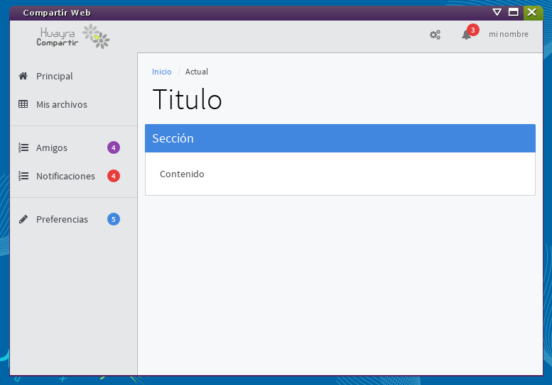

Huayra-Compartir
================

Huayra-Compartir es una herramienta diseñada para compartir distintos tipos
de archivos dentro de una red local.

Este software forma parte del proyecto Huayra Gnu/Linux, es software libre y
se distribuye instalado en las netbooks del Programa Conectar Igualdad en Argentina.

Instalación
-----------

Si querés probar esta aplicación directamente desde este repositorio, tenés
que seguir estos pasos:

- clonar el repositorio.
- instalalar nodejs.
- instalar `bower` de forma global con el comando `sudo npm install -g bower`.
- ejecutar `make init` en el directorio del proyecto para instalar todas las dependencias.
- ejecutar `make test_mac` o `make test_linux` dependiendo de tu sistema operativo.